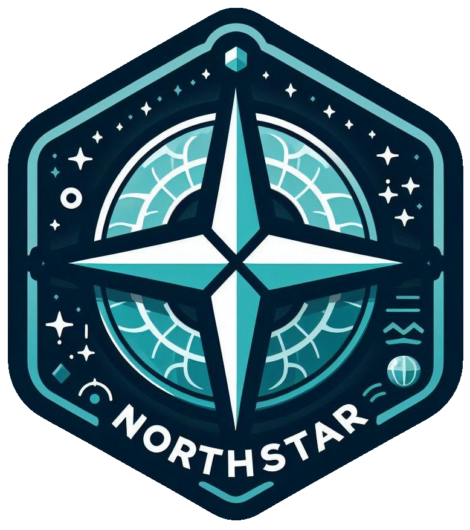

<!-- README.md is generated from README.Rmd. Please edit that file -->

```{r, include = FALSE}
knitr::opts_chunk$set(
  collapse = FALSE,
  comment = ">",
  fig.path = "man/figures/README-",
  out.width = "100%"
)
```

# northstar 

> Tidy Healthcare Revenue Integrity Tools

<!-- badges: start -->

```{r echo=FALSE}
badges <- data.frame(
  x = c(
  "[](https://app.codecov.io/gh/andrewallenbruce/northstar?branch=master)",
  "[](https://www.codefactor.io/repository/github/andrewallenbruce/northstar)",
  "[](https://github.com/andrewallenbruce/northstar)",
  "[](https://github.com/andrewallenbruce/northstar/commits/master)",
  "[-blue.svg)](https://cran.r-project.org/web/licenses/Apache License (>= 2)",
  "[](https://github.com/andrewallenbruce/northstar)")
)

colnames(badges) <- NULL

tinytable::tt(badges) |> 
  print("markdown")
```

[](https://app.codecov.io/gh/andrewallenbruce/northstar?branch=master)
[](https://www.codefactor.io/repository/github/andrewallenbruce/northstar)
[](https://github.com/andrewallenbruce/northstar)
[](https://github.com/andrewallenbruce/northstar/commits/master)
[-blue.svg)](https://cran.r-project.org/web/licenses/Apache License (>= 2))
[](https://github.com/andrewallenbruce/northstar)
<!-- badges: end -->

<br>

## :package: Installation

You can install **northstar** from [GitHub](https://github.com/) with:

``` r
# install.packages("pak")
pak::pak("andrewallenbruce/northstar")
```

## :beginner: Usage

```{r warning=FALSE, message=FALSE}
library(northstar)
library(dplyr)
```


## Search HCPCS Codes

```{r}
hcpcs_search(hcpcs    = "33935", 
             state    = "GA", 
             locality = "01", 
             mac      = "10212") |> 
  glimpse()
```

## Search ICD-10 Codes

```{r}
icd10_search(code  = "T38.0X1A", 
             field = "code") |> 
  case_section_icd10(code) |> 
  dplyr::glimpse()
```


## Physician Fee Schedule Calculation

```{r}
calculate_amounts(
  wrvu  = 6.26,
  nprvu = 7.92,
  fprvu = 4.36,
  mrvu  = 0.99,
  cf    = 32.744,
  wgpci = 1,
  pgpci = 0.883,
  mgpci = 1.125
)
```


------------------------------------------------------------------------------

## :balance_scale: Code of Conduct

Please note that the `northstar` project is released with a [Contributor Code of Conduct](https://andrewallenbruce.github.io/northstar/CODE_OF_CONDUCT.html). By contributing to this project, you agree to abide by its terms.

<br>

## :classical_building: Governance

This project is primarily maintained by [Andrew Bruce](https://github.com/andrewallenbruce). Other authors may occasionally assist with some of these duties.
